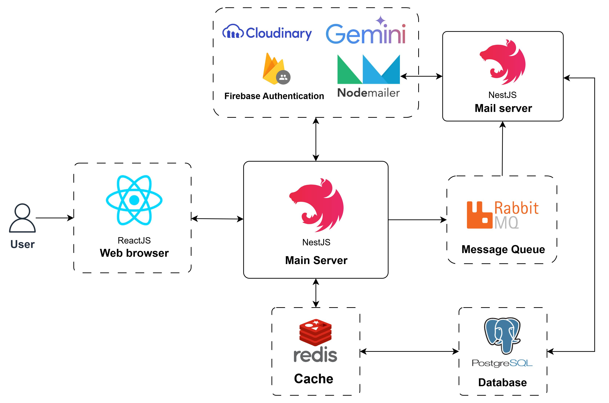

##Topic: VSDP Scholarship Management
##TechStack:
  - Front-end: ReactJS, Typescript, TailwindCss, Antd, Dnd-kit/core.
  - Back-end: NodeJS(NestJS with Prisma).
  - Database: PostgreSQL, Redis.
  - MessageQueue: RabbitMQ.
  - Containerization: Docker.
  - 3rd-Party: Cloudinary, Gemini AI, Firebase.
##Features: 
  - Developed a drag-and-drop e-form builder integrated with AI for dynamic form generation.
  - Integrated a user management system with role-based access control (RBAC).
  - Implemented user authentication and authorization using JWT for secure access control.
  - Designed and implemented a multi-step applicant evaluation process: submission - filtering - assignment - scoring - interview - result publishing.
  - Built a password recovery system with one-time password (OTP) authentication and Redis for temporary OTP storage and expiration handling.
  - Integrated RabbitMQ to handle email sending in a non-blocking way, improving performance and user experience.
##Architecture:

